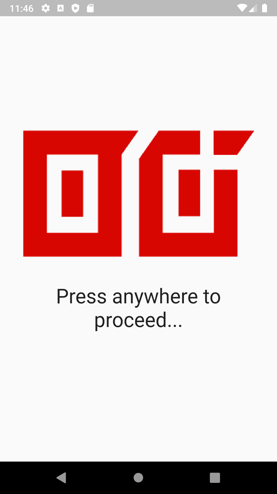
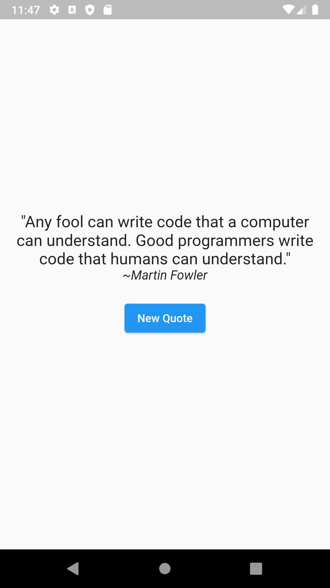

# Empty Readme.md
This app displays random, maybe funny, sentence by someone smart.

## This is my main plan for the application
TODOS:
- [ ] create page-route animation
- [ ] update README.md  (this is currently used for project planning) 
- [ ] style, style and style! (change design)
- [ ] find more smart looking sentences 
- [ ] learn how to deploy app

# Images 

